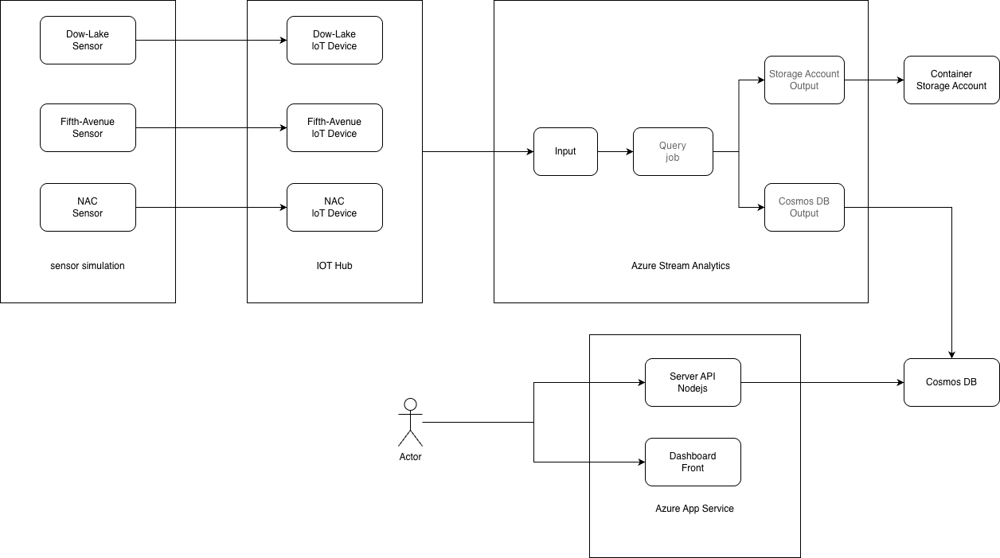
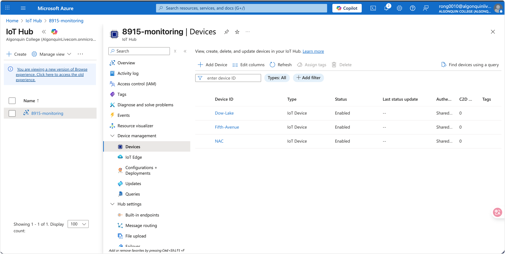
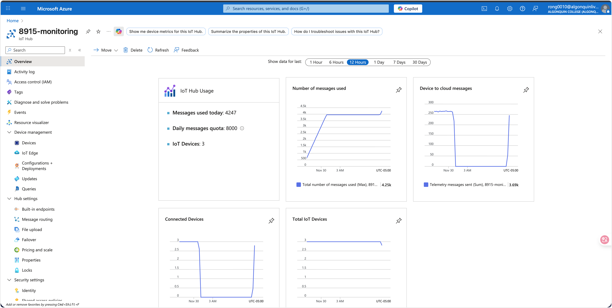
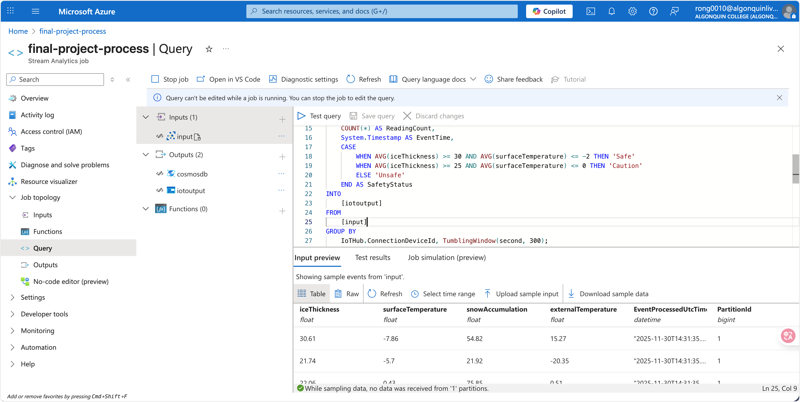
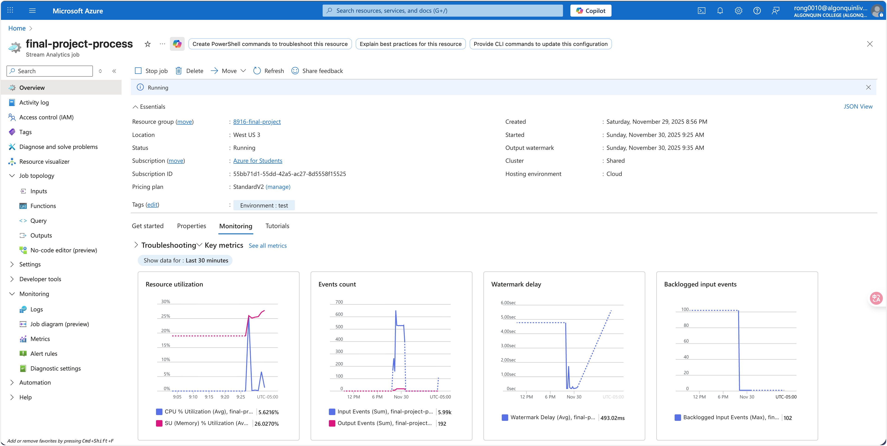
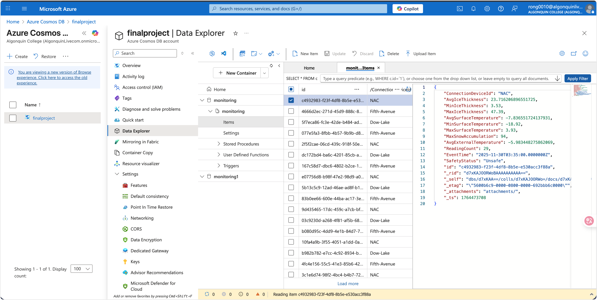
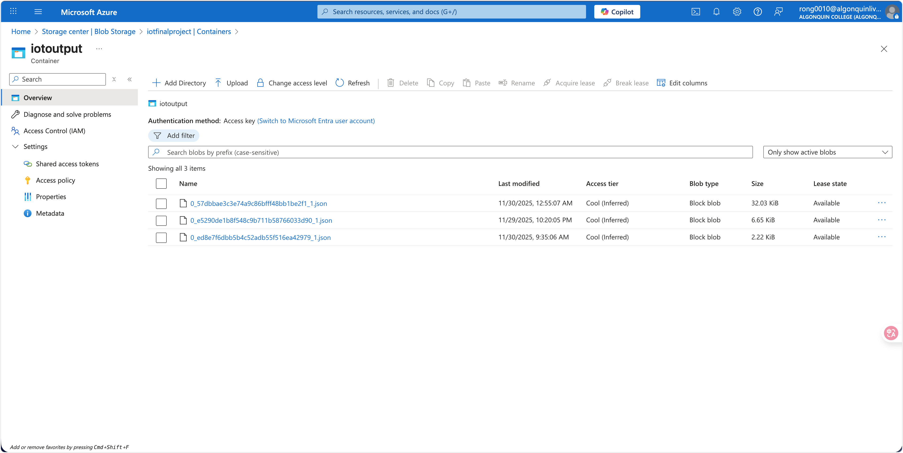
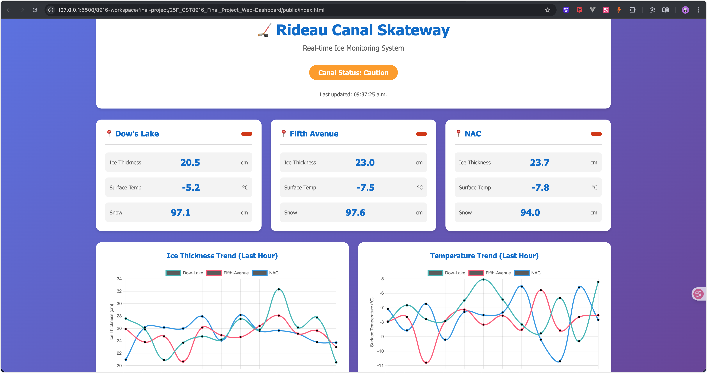
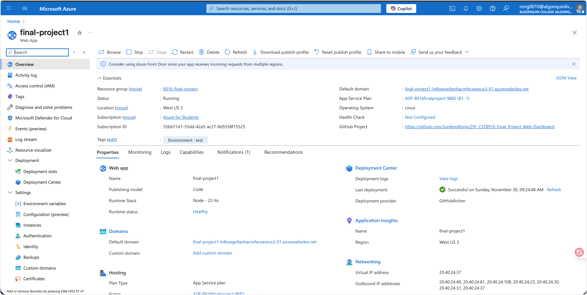

1. **Project Title and Description**
   - Rideau Canal Real-time Monitoring System
   - It is a monitoring system that simulates IoT sensors along the Rideau Canal Skateway in Ottawa, and then build a pipeline that processes, stores, and visualizes the data to help ensure skater safety.


2. **Student Information**
   - Junfeng Rong
   - 041176879
   - Web Dashboard Repository: https://github.com/JunfengRong/25F_CST8916_Final_Project_Web-Dashboard

3. **Scenario Overview**
   - Problem statement
     - The Rideau Canal is a major waterway in Ottawa, Canada, known for its ice-covered waters. Skaters navigate the canal using skatertracks, which are paths of ice-covered water. However, the ice on the skatertracks can change rapidly, leading to potential hazards for skaters.
   - System objectives
     - Skaters must be able to monitor the ice conditions in real-time to avoid accidents, to visualize the ice conditions on the skatertracks in real-time.

4. **System Architecture**
   - Architecture diagram (in `architecture/` folder)
   - 
   - Data flow explanation
     - generate simulated sensor data at three locations: Dow’s Lake, Fifth Avenue, and the NAC every 10 seconds
     - send the simulated sensor data to the Azure IoT Hub
     - process the data in the Stream Analytics job
     - store the processed data in Cosmos DB and Blob Storage
     - visualize the data in the Web Dashboard
   - Azure services used
     - Azure IoT Hub
     - Stream Analytics
     - Cosmos DB
     - Blob Storage
     - Azure App Service

5. **Implementation Overview**
   - Brief description of each component:
     - IoT Sensor Simulation (link to repo)
       - https://github.com/JunfengRong/rideau-canal-sensor-simulation
     - Azure IoT Hub configuration
       - create three devices: Dow’s Lake, Fifth Avenue, and the NAC
     - Stream Analytics job (include query)
      ```SQL
      SELECT 
         IoTHub.ConnectionDeviceId AS ConnectionDeviceId,
         AVG(iceThickness) AS AvgIceThickness,
         MIN(iceThickness) AS MinIceThickness,
         MAX(iceThickness) AS MaxIceThickness,
         AVG(surfaceTemperature) AS AvgSurfaceTemperature,
         MIN(surfaceTemperature) AS MinSurfaceTemperature,
         MAX(surfaceTemperature) AS MaxSurfaceTemperature,
         MAX(snowAccumulation) AS MaxSnowAccumulation,
         AVG(externalTemperature) AS AvgExternalTemperature,
         COUNT(*) AS ReadingCount,
         System.Timestamp AS EventTime,
         CASE
            WHEN AVG(iceThickness) >= 30 AND AVG(surfaceTemperature) <= -2 THEN 'Safe'
            WHEN AVG(iceThickness) >= 25 AND AVG(surfaceTemperature) <= 0 THEN 'Caution'
            ELSE 'Unsafe'
         END AS SafetyStatus
      INTO
         [iotoutput]
      FROM
         [input]
      GROUP BY
         IoTHub.ConnectionDeviceId, TumblingWindow(second, 300);

      SELECT 
         IoTHub.ConnectionDeviceId AS ConnectionDeviceId,
         AVG(iceThickness) AS AvgIceThickness,
         MIN(iceThickness) AS MinIceThickness,
         MAX(iceThickness) AS MaxIceThickness,
         AVG(surfaceTemperature) AS AvgSurfaceTemperature,
         MIN(surfaceTemperature) AS MinSurfaceTemperature,
         MAX(surfaceTemperature) AS MaxSurfaceTemperature,
         MAX(snowAccumulation) AS MaxSnowAccumulation,
         AVG(externalTemperature) AS AvgExternalTemperature,
         COUNT(*) AS ReadingCount,
         System.Timestamp AS EventTime,
         CASE
            WHEN AVG(iceThickness) >= 30 AND AVG(surfaceTemperature) <= -2 THEN 'Safe'
            WHEN AVG(iceThickness) >= 25 AND AVG(surfaceTemperature) <= 0 THEN 'Caution'
            ELSE 'Unsafe'
         END AS SafetyStatus
      INTO
         [cosmosdb]
      FROM
         [input]
      GROUP BY
         IoTHub.ConnectionDeviceId, TumblingWindow(second, 300);
      ```

     - Cosmos DB setup
       - create a Cosmos DB and a container to store the processed data
     - Blob Storage configuration
       - create a Blob Storage account and a container to store the raw sensor data
     - Web Dashboard (link to repo)
       - https://github.com/JunfengRong/25F_CST8916_Final_Project_Web-Dashboard
     - Azure App Service deployment
       - Create an Azure App Service and deploy the Web Dashboard

6. **Repository Links**
   - Link to sensor simulation repository: https://github.com/JunfengRong/rideau-canal-sensor-simulation
   - Link to web dashboard repository: https://github.com/JunfengRong/25F_CST8916_Final_Project_Web-Dashboard
   - Link to live dashboard deployment

7. **Video Demonstration**
   - Embedded video or link: https://www.youtube.com/watch?v=F5RTTaR9mkg

8. **Setup Instructions**
   - Prerequisites
   - High-level setup steps
     - Create a IOT hub with three devices
     - Develop a simulated sensor data generator and run it to send data to the IOT hub
     - Create a Stream Analytics job, a Storage account and a Cosmos DB
     - Run a query in the Stream Analytics job to process the data into the Cosmos DB and Blob Storage
     - Deploy the Web Dashboard to Azure App Service
   - Links to detailed setup in component repos
     - IoT Sensor Simulation: https://github.com/JunfengRong/rideau-canal-sensor-simulation
     - Dashboard: https://github.com/JunfengRong/25F_CST8916_Final_Project_Web-Dashboard
9. **Dashboard Screenshots**
   
   
   
   
   
   
   
   

10. **AI Tools Disclosure** (if used)
    - Tools used and how
      - Using ChatGPT to generate the sensors' code to simulate data
    - What was AI-generated vs your work
      - The AI-generated code was used as a starting point, and then modified to fit the project's needs.
11. **References**
    - Libraries used
      - Azure IoT SDK for Python
    - Other resources
      - ChatGPT